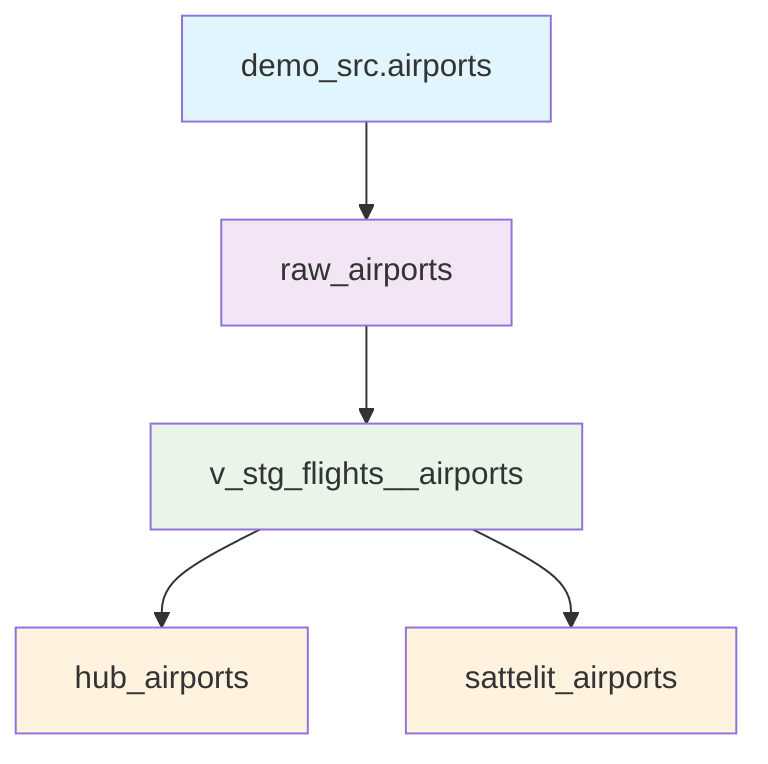

# Data Vault Architecture для Аэропортов

## Обзор архитектуры

Данный проект реализует Data Vault архитектуру для обработки данных об аэропортах. Архитектура состоит из следующих слоев:



## Структура файлов

### 1. Raw Stage Layer (`raw_airports.sql`)
**Назначение**: Первичная обработка сырых данных из источника

**Что делает**:
- Извлекает данные из таблицы `demo_src.airports`
- Добавляет метаданные: `RECORD_SOURCE` и `LOAD_DATE`
- Материализуется как таблица для производительности

**Ключевые поля**:
- `airport_code` - уникальный код аэропорта
- `airport_name` - название аэропорта
- `city` - город
- `coordinates` - географические координаты
- `timezone` - часовой пояс
- `RECORD_SOURCE` - источник данных (всегда 'bookings')
- `LOAD_DATE` - время загрузки записи

### 2. Stage Layer (`v_stg_flights__airports.sql`)
**Назначение**: Подготовка данных для Data Vault с хешированием

**Что делает**:
- Использует AutomateDV пакет для автоматического хеширования
- Создает хеш-ключи (`AIRPORT_HK`) и хеш-разности (`AIRPORT_HASHDIFF`)
- Добавляет системные поля: `SOURCE`, `LOAD_DATETIME`, `EFFECTIVE_FROM`
- Материализуется как view для актуальности данных

**Ключевые преобразования**:
- `AIRPORT_HK = hash(airport_code)` - хеш-ключ для hub таблицы
- `AIRPORT_HASHDIFF = hash(airport_name, city, coordinates, timezone)` - хеш-разность для satellite
- `SOURCE = '!1'` - константа для отслеживания источника
- `LOAD_DATETIME = LOAD_DATE` - время загрузки
- `EFFECTIVE_FROM = LOAD_DATE::date` - дата начала действия

### 3. Hub Layer (`hub_airports.sql`)
**Назначение**: Центральная таблица для уникальных бизнес-ключей

**Что делает**:
- Содержит уникальные идентификаторы аэропортов
- Связывает все связанные данные через хеш-ключи
- Материализуется как incremental таблица для эффективности

**Структура**:
- `AIRPORT_HK` - хеш-ключ (первичный ключ)
- `airport_code` - натуральный ключ аэропорта
- `LOAD_DATETIME` - время загрузки
- `SOURCE` - источник данных

### 4. Satellite Layer (`sattelit_airports.sql`)
**Назначение**: Хранение атрибутов и истории изменений

**Что делает**:
- Содержит все атрибуты аэропортов
- Отслеживает историю изменений через хеш-разности
- Материализуется как incremental таблица

**Структура**:
- `AIRPORT_HK` - ссылка на hub таблицу
- `AIRPORT_HASHDIFF` - хеш-разность для отслеживания изменений
- `airport_name`, `city`, `coordinates`, `timezone` - атрибуты
- `EFFECTIVE_FROM` - дата начала действия записи
- `LOAD_DATETIME` - время загрузки
- `SOURCE` - источник данных

## Конфигурация

### packages.yml
```yaml
packages:
  - package: Datavault-UK/automate_dv
    version: 0.9.0
```

### Схемы данных
- `_stage__schema.yml` - тесты для stage моделей
- `_raw_vault__schema.yml` - тесты для Data Vault моделей

## Запуск проекта

1. **Установка зависимостей**:
```bash
dbt deps
```

2. **Запуск моделей**:
```bash
# Запуск всех моделей
dbt run

# Запуск конкретного слоя
dbt run --select raw_airports
dbt run --select v_stg_flights__airports
dbt run --select hub_airports
dbt run --select sattelit_airports
```

3. **Запуск тестов**:
```bash
dbt test
```

## Преимущества архитектуры

1. **Гибкость**: Легко добавлять новые источники данных
2. **Масштабируемость**: Incremental загрузка для больших объемов
3. **Историчность**: Полное отслеживание изменений
4. **Производительность**: Оптимизированные хеш-ключи
5. **Стандартизация**: Использование проверенных паттернов Data Vault

## Мониторинг

Для мониторинга выполнения можно использовать:
```bash
# Просмотр DAG
dbt ls --select +hub_airports

# Проверка зависимостей
dbt deps --select +hub_airports
``` 